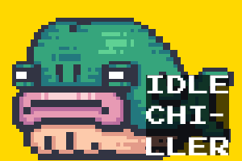

# IdleChiller Twitch Extension

**IdleChiller extension is now live on Twitch Extension Store. Contact us to add your server to whitelist and use it for your own game.**

The IdleChiller Twitch Extension allows streamers and viewers on Twitch to interact with the IdleChiller game, providing a lo-fi idling grinding experience. The project consists of three main parts: the game engine powered by Godot, a Flask backend, and a React-based frontend extension. Here's a breakdown of the project structure and how to get it up and running.

<p align="center">
  
</p>

## Project Structure

1. **TwitchBotGodot**

   This folder contains the Godot project files for the IdleChiller game.

   - `main.gd`: Main script file that runs the game logic.
   - `game.tscn`: The primary scene file for the game.
   - `websocket_handler.gd`: Script for handling WebSocket connections to interact with the Flask backend.

2. **backendFlask**

   This folder hosts the Flask backend server which acts as an intermediary between the Twitch extension and the Godot game engine.

   - `app.py`: Main Flask app script. Handles HTTP requests from the extension and communicates with Godot via WebSocket.
   - `requirements.txt`: List of Python dependencies required for running the Flask app.

3. **twitcher-react**

   This folder contains the React project for the Twitch extension.

   - `src/App.js`: Main React component file.
   - `src/App.css`: Stylesheet for the React app.
   - `public/index.html`: The HTML template file.
   - `package.json`: Lists all the npm dependencies and scripts for running the React app.

## How to Run

1. **Running the Godot Game**

    - Open the Godot project in Godot Engine.
    - Press F5 to run the project.

2. **Starting the Flask Backend**

    - Navigate to the `backendFlask` directory.
    - Install the required dependencies using pip:

    ```bash
    pip install -r requirements.txt
    ```

    - Run the Flask app:

    ```bash
    python app.py
    ```

3. **Launching the React Frontend**

    - Navigate to the `twitcher-react` directory.
    - Install the required npm packages:

    ```bash
    npm install
    ```

    - Start the React app:

    ```bash
    npm start
    ```

## Interaction Flow

- **User Interaction:** Users interact with the Twitch extension (React frontend), triggering events based on button clicks.
- **Command Forwarding:** The frontend sends HTTP requests to the Flask backend, which in turn communicates with the Godot game engine via WebSocket.
- **Game State Update:** The game engine processes the commands, updates the game state, and sends the new game state back through the WebSocket.
- **State Reflection:** The Flask backend forwards the game state to the frontend, which then updates the UI to reflect the current game state.

With this setup, users can interact with the IdleChiller game in real-time via the Twitch extension, enjoying a seamless lo-fi idling grinding experience.
